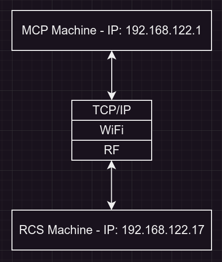
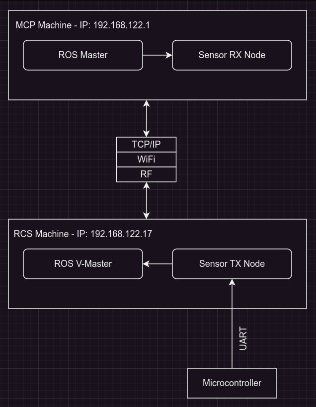

# ROS Tutorial Part 3 - ROS Network Setup

### 3.1 Basic ROS Network
- The most basic ROS network typically consists of two machines
1. Robot Control System (RCS): Usually a Raspberry Pi connected to a microcontroller board
2. Main Control Panel (MCP): Usually a portable PC
<p align="center">
    
</p>

- Note: These IPs are in my virtual network only they will change in your setup

- In hard robotic operations environment like underwater or air ROVs we usually  
split **MCP** task into two machines the operations panel and the maintaince panel  
in this setup one or more co-pilots can assist the main pilot by monitoring the system health

### 3.2 Network Deployment
- To simulate the ROS network shown in the diagram, I will use my PC as the **MCP** machine and  
I will create a KVM virtual machine and install **Ubuntu Server LTS** on it  
this KVM instance will be the **RCS** machine
- After finishing this setup here is my network config
```bash
ubuntu@mcp:~$ ifconfig virbr0

# virbr0: flags=4163<UP,BROADCAST,RUNNING,MULTICAST>  mtu 1500
#         inet 192.168.122.1  netmask 255.255.255.0  broadcast 192.168.122.255
```
```bash
ubuntu@rcs:~$ ifconfig enp1s0

# enp1s0: flags=4163<UP,BROADCAST,RUNNING,MULTICAST>  mtu 1500
#         inet 192.168.122.17  netmask 255.255.255.0  broadcast 192.168.122.255
```

### 3.3 Starting MCP ROS Master
- ROS master is recommended to run the **MCP** machine  
because it's stronger and can handle the communication overhead
- On **MCP** machine run the ROS master docker compose script refer to [Starting ROS Master](../part_2_getting_started/README.md#22-starting-ros-master)
- Make sure to make **ROS_MASTER_URI** and **ROS_IP** docker environment variables point to **MCP** machine ip
- For example in this case our docker-compose script will look like this
```yml
services:

  ros:
    # stdin_open: true
    # tty: true
    image: 'ros:noetic-ros-base-focal'
    network_mode: 'host'
    environment:
      - ROS_MASTER_URI=http://192.168.122.1:11311/
      - ROS_IP=192.168.122.1
    command: 'roscore'

```

### 3.4 Basic ROS App 1
- In this section we will implement the following ROS app
<p align="center">
    
</p>

**1. ROS V-Master:**  
- this node do not exist it's just to reduce arrows connected to **MCP** ROS Master node

**2. Sensor TX Node:**  
- This node will run on the **RCS** machine
- It will read a sensor from the robot's microcontroller over UART
- Then transmit it in the ROS network so it can be consumed by other nodes on the network

**3. Sensor RX Node:**  
- This node will run on the **MCP** machine
- It will just print the sensor value

**Sensor TX Node Implementation:**  
- [Source Code](../basic_ros_app_1/sensor_tx.py)
```python
import sys
import time
import rospy
import std_msgs.msg as ros_std_msgs

import ros_helper


def read_sensor_over_uart() -> str:
    ''' this function will simulate reading a value over uart from the robot MCU board '''
    return f"timestamp-{round(time.time())}"


if __name__ == '__main__':
    if not ros_helper.init_node('sensor_tx_node', ros_helper.RosMachine.RCS_MACHINE):
        sys.exit(1)

    sensor_tx_publisher: rospy.Publisher = rospy.Publisher('/robot/sensor', ros_std_msgs.String, queue_size=10)
    # /robot/sensor: sensor_tx_node publisher topic
    # ros_std_msgs.String: message type
    # The queue size used for asynchronously publishing messages from different threads

    while not rospy.is_shutdown():
        try:
            sensor_value = read_sensor_over_uart()
            sensor_tx_publisher.publish(sensor_value)
            time.sleep(2)

        except rospy.ROSInterruptException:
            break

```
- To start sensor_tx_node first make sure ROS master is running on **MCP** machine
- Then run the script using the following command
```bash
$ python ./basic_ros_app_1/sensor_tx.py

# Initializing ROS Node sensor_rx_node...
# Initializing ROS Node sensor_rx_node...OK
```
- You can verify if sensor_tx_node is up by running these commands
```bash
$ docker exec -it basic_ros_app_1-ros-1 /bin/bash # connect to ROS master docker shell
$ source ros_entrypoint.sh # setup shell environment
```

```bash
$ rostopic echo /robot/sensor 

# data: "timestamp-1728072155"
# ---
# data: "timestamp-1728072157"
# ---
```

**Sensor RX Node Implementation:**  
- [Source Code](../basic_ros_app_1/sensor_rx.py)
```python
import sys
import rospy
import time
import std_msgs.msg as ros_std_msgs

import ros_helper


def ros_subscriber_handler(msg: ros_std_msgs.String):
    print('robot_sensor:', msg.data)


if __name__ == '__main__':
    if not ros_helper.init_node('sensor_rx_node', ros_helper.RosMachine.MCP_MACHINE):
        sys.exit(1)

    sensor_rx_subscriber = rospy.Subscriber = rospy.Subscriber('/robot/sensor', ros_std_msgs.String, ros_subscriber_handler)
    # ros_std_msgs.String: message type
    # ros_subscriber_handler: this function get called whenever a message is received

    while not rospy.is_shutdown():
        try:
            time.sleep(1)

        except rospy.ROSInterruptException:
            break

```
- Starting sensor_rx_node
```bash
$ python ./basic_ros_app_1/sensor_rx.py

# Initializing ROS Node sensor_rx_node...
# Initializing ROS Node sensor_rx_node...OK
# robot_sensor: timestamp-1728073318
# robot_sensor: timestamp-1728073320
```
